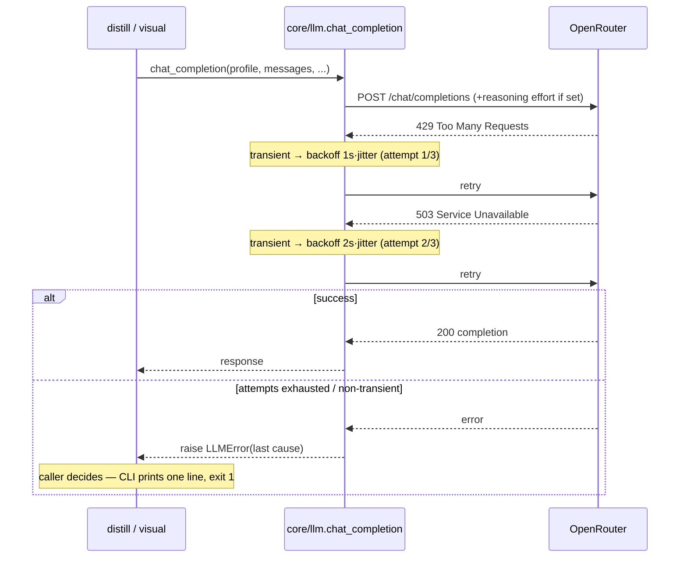
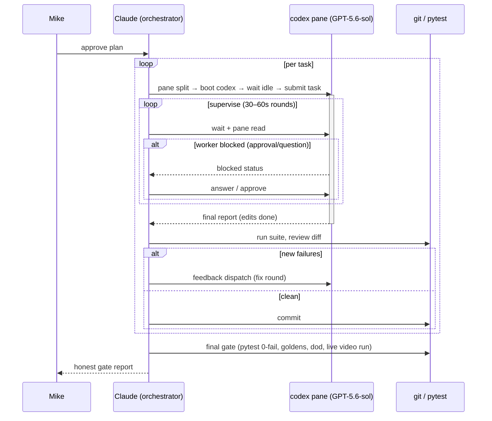

# Robustness Hardening — Design (Sub-project 2)

**Date:** 2026-07-18 (rev 2 — enriched with flows + traceability)
**Status:** Approved scope (from 2026-07-16 trilogy design); this spec details it
**Predecessor:** `2026-07-16-modular-restructure-design.md` (complete)

## Problem statement

The pipeline is functionally complete but **fragile in two dimensions**:

**P1 — Platform fragility.** Developed on WSL/Linux, the code silently corrupts
on Windows. 8 tests fail out of the box, and the failures are *product* bugs,
not test bugs:

| # | Evidence (failing test) | Root cause | User-visible impact |
|---|---|---|---|
| P1a | `test_golden` ×4 — "golden drift" | Text I/O without `encoding="utf-8"` → prompts/styles read as cp1252, `—` becomes `â€"` | **Corrupted prompt contracts sent to the LLM** on every Windows distill |
| P1b | `test_distill_live` — `UnicodeEncodeError` | cp1252 console can't print `⚠` | Distill **crashes** while reporting citation warnings |
| P1c | `test_reconcile` ×2 — `repo:src\scene.py` | OS-native separators leak into citations | **Citations don't validate cross-machine**; artifacts not portable |
| P1d | `test_reference_follower` — `KeyError: 'src/main.py'` | Same separator leak in snapshot file maps | Repo evidence lookups miss on Windows |

**P2 — Network fragility.** Every external interaction is one transient error
away from a dead run:

| # | Evidence | Root cause | User-visible impact |
|---|---|---|---|
| P2a | 3 LLM call sites (`distill.py:218`, `visual.py:313`, `models.py:110+`) — zero retry logic, 3 duplicated clients | A single 429/5xx from OpenRouter kills a distill that already spent minutes on extract/OCR | Wasted runs, wasted spend |
| P2b | `references.py` fetches with bare `requests` | One flaky fetch fails the reference harvest | Missing repo evidence in bundles |
| P2c | `Profile.reasoning_effort` resolves but is never sent | Task 7 wired the field, not the request | `gemini-3.5-flash-high` profile silently behaves like default |

**P3 — Failure opacity.** Everything raises bare `RuntimeError`; the CLI shows
tracebacks for predictable user errors (bad URL, missing title dir, unknown
style). Callers can't distinguish "transcript unavailable" from "LLM down."

## Goal

**P1 → the 8-test Windows baseline goes to zero** (full pytest, golden
byte-compare, `dod_check.sh` all green on Windows). **P2/P3 → every external
interaction retries transients, and every predictable failure surfaces as a
typed, catchable, one-line error.**

Constraints carried forward: zero functionality loss; styles/artifact formats
unchanged; helpers raise catchable errors, never SystemExit.

## System view — where the pipeline breaks today

```mermaid
flowchart LR
    subgraph extract["yt-distill extract (Phase 1)"]
        SRC[URL / local file] --> T[4-tier transcript chain]
        T --> F[frames + OCR]
        F --> M[artifact tree + manifest]
    end
    subgraph refs["yt-distill refs (Phase 1.5)"]
        M --> H[harvest URLs] --> SNAP[repo snapshots @SHA]
    end
    subgraph distill["yt-distill distill (Phase 2)"]
        M --> E[enrich + frame select]
        SNAP --> R[reconcile]
        E --> P[payload build]
        R --> P
        P --> LLM[LLM call]
        LLM --> V[citation validation]
        V --> OUT[markdown + JSON + skill bundle]
    end

    STYLES[styles/ + prompts/] -.->|"P1a: read w/o utf-8 → mojibake"| P
    R -.->|"P1c: os-native paths in citations"| V
    SNAP -.->|"P1d: os-native paths in file maps"| R
    V -.->|"P1b: ⚠ crashes cp1252 console"| OUT
    LLM -.->|"P2a: no retry, 1×429 = dead run"| P
    H -.->|"P2b: bare requests, no backoff"| SNAP

    classDef prob stroke:#e74c3c,stroke-width:2px,stroke-dasharray: 5 5;
    class STYLES,H prob;
```

Dashed red edges = the failure injection points this spec eliminates.

## Work items

Each item names the problem(s) it addresses; the matrix below closes the loop.

### 1. UTF-8 everywhere — *addresses P1a, P1b*
- Every text-mode `open()`, `Path.read_text()`, `Path.write_text()` in `src/`
  and `scripts/` gets `encoding="utf-8"` (~54 sites, mechanical).
- `cli.py:main` reconfigures `sys.stdout`/`sys.stderr` to UTF-8
  (`errors="replace"`) so symbol output can't crash any console.
- Golden fixtures stay byte-identical to committed content — the fix makes
  Windows *produce* what Linux already produced.

### 2. POSIX path normalization at artifact boundaries — *addresses P1c, P1d*
- Any repo-/artifact-relative path written into artifacts or citations
  (`repo:path#Lx-Ly@SHA`, `reconciliation.json`, snapshot file maps,
  `ocr.json` frame paths) is normalized via `as_posix()` at the
  write/compare boundary. OS-native paths remain for filesystem access only.

### 3. Central LLM client + retries + reasoning_effort — *addresses P2a, P2c*
- New `src/yt_distill/core/llm.py`: `make_client(profile)` +
  `chat_completion(profile, **kwargs)`; consumed by `pipeline/distill.py`,
  `stages/visual.py`, `core/models.py` (doctor probes keep single-attempt
  semantics).
- Retries transient failures (408/425/429/5xx, connection/timeout) with
  exponential backoff + jitter, 3 attempts; non-transient raises immediately;
  terminal failure raises `LLMError` carrying the last cause.
- `profile.reasoning_effort` → OpenRouter `reasoning: {"effort": ...}` via
  `extra_body`.

### 4. Typed exception hierarchy — *addresses P3*
- `src/yt_distill/core/errors.py`: `YtDistillError(RuntimeError)` base;
  subclasses `TranscriptError`, `ExtractError`, `DistillError`,
  `CitationError`, `RefFollowError`, `LLMError`, `ModelConfigError`.
- RuntimeError base keeps every existing `except RuntimeError` caller
  working. Helpers switch raises to specific types.
- `cli.py` catches `YtDistillError` → one-line stderr + exit 1; unexpected
  exceptions still traceback (those are bugs, not user errors).

### 5. HTTP retries for reference following — *addresses P2b*
- `requests.Session` + `urllib3.util.Retry` (3 total, backoff 0.5, respect
  Retry-After, idempotent methods only) in `stages/references.py`.
- Transcript chain intentionally unchanged: tier fallback IS its retry
  policy; inner loops would slow the economical-first ladder.

### 6. CLI input validation — *addresses P3*
- `extract`/`run`: source must be an existing file or http(s)/youtu.be URL —
  clear message before any work starts.
- `distill`/`review`/`refs`/`enrich`: title dir must exist and contain
  `artifact_manifest.json`; unknown styles list available styles.

### Non-goals
- No logging framework migration (print progress is the CLI's UX).
- No new pipeline features (sub-project 3).
- No test restructuring beyond what fixes require.

## Traceability matrix

| Problem | Work item | Verified by |
|---|---|---|
| P1a mojibake | 1 (UTF-8 I/O) | golden byte-compare clean on Windows; `test_golden` ×4 green |
| P1b console crash | 1 (stdout reconfigure) | `test_distill_live` green; live run prints `⚠` safely |
| P1c citation paths | 2 (POSIX normalize) | `test_reconcile` ×2 green |
| P1d snapshot maps | 2 (POSIX normalize) | `test_reference_follower` green |
| P2a LLM fragility | 3 (llm.py retries) | new unit tests: flaky-mock client succeeds on 3rd try; non-transient raises once |
| P2c effort unsent | 3 (extra_body wiring) | new unit test asserts `reasoning` in request kwargs for `-high` profile |
| P2b fetch fragility | 5 (Session+Retry) | new unit test: mocked 502→200 fetch succeeds |
| P3 opacity | 4 + 6 (errors.py, validation) | new unit tests: bad source/style/dir → typed error, exit 1, no traceback |

## Execution model

Codex workers (GPT-5.6-sol) via `herdr-fleet` interactive pattern; Kimi K3
(`moonshotai/kimi-k3`, key from env `OPENROUTER_API_KEY`) reserved for
cross-model review later.

## Verification gate
1. Full `uv run pytest` on Windows: **0 failures** (baseline eliminated).
2. `uv run python scripts/regen_golden_payloads.py` → `git status` clean
   (byte-identical goldens on Windows).
3. `bash scripts/dod_check.sh` fully green on Windows.
4. Live end-to-end on the real test video
   `https://youtu.be/EnXKysJNz_8`: `uv run yt-distill run <url> auto`
   completes with zero unresolved citations; second run confirms idempotent
   skip. (Also exercises retry path against live OpenRouter incidentally.)
5. Retry behavior unit-tested with mocked flaky clients — no live-failure
   simulation required.
