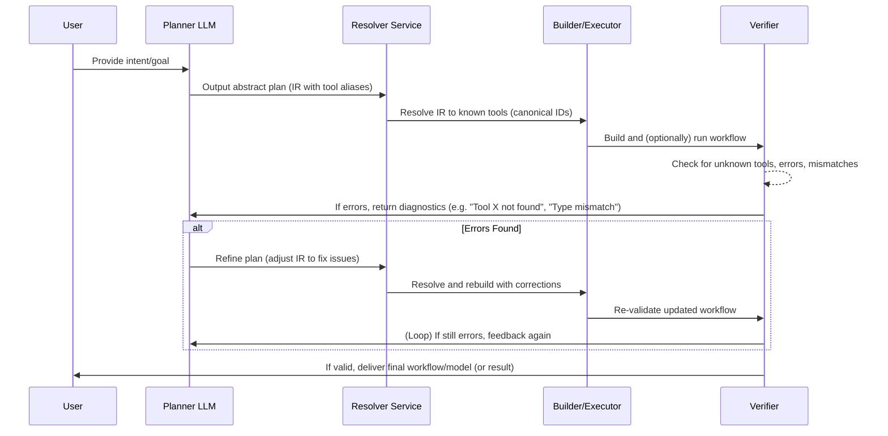

# Grounded Tool Resolution Architecture for LLM-Controlled Systems

## Overview of Challenges and Objectives

Large Language Models (LLMs) often hallucinate or misuse tools when controlling complex graph-based systems (e.g. [[tool/simulink|Simulink]] models, [[tool/n8n|n8n]] workflows). Common failure modes include:

*   **Nonexistent Tools (Hallucination):** LLMs invent blocks/nodes that do not exist in the target system. For example, suggesting a “Servo Motor” block by name when no such canonical block exists (Simulink has specific servo blocks in toolboxes, but the LLM might fabricate a name).
*   **Incorrect Naming:** Using human-friendly names instead of canonical IDs or internal names. E.g. referring to an n8n node by its label instead of the internal type ID, or using a Simulink block’s colloquial name instead of its library path.
*   **Overly Generic Tools:** Picking generic or catch-all tools (like an HTTP Request node in n8n) instead of a specialized integration node. This leads to suboptimal or non-functional plans (e.g. using a raw HTTP node to call a Google API when a dedicated “Google Sheets” node exists).
*   **Ontology Drift:** Straying from the allowed toolset or system ontology even after correction. The LLM may introduce disallowed nodes or wrong subsystem types as it continues reasoning, due to either forgetting instructions or lacking a grounded understanding of the system’s schema.
*   **Wrong Abstraction/Version:** Choosing tools at the wrong abstraction level (e.g. manually constructing a low-level configuration when a high-level block exists, or vice versa) and using tools from the wrong version or library (e.g. a block from a newer Simulink version not available in the current environment).

### Objective

Design a robust, production-grade architecture for “Grounded Tool Resolution” that prevents hallucinations by construction and guides the LLM to valid, precise tool selections. The solution must be systemic (architectural) – not merely prompt tweaks – and should work even with mediocre models or limited tool knowledge. It should generalize across domains ([[tool/simulink|Simulink]], [[tool/n8n|n8n]], CAD, DevOps pipelines, etc.) by enforcing a process that grounds the LLM’s output in a canonical tool registry and includes verification and self-correction loops.

### Key Goals for the Architecture

*   **Grounded Tool Selection:** The LLM can only use tools/blocks that exist in a [[concept/tool-registry|Tool Registry]] (a source of truth). Any referenced tool must resolve to a known canonical ID or it is rejected/fixed. This makes inventing tools impossible by design.
*   **Ontology Alignment:** The system provides the LLM with the actual ontology of the target environment – including canonical tool names/IDs, aliases, categories, and capabilities – so the model’s plan stays within the allowed graph of tools.
*   **Preference for Native Tools:** Make it easier (or automatic) for the LLM to choose the correct native/specialized tool over generic fallbacks. The architecture should recognize when a specialized tool is available for a task and either bias selection toward it or replace generic nodes with the appropriate specialized ones.
*   **Stepwise Validation and Correction:** Introduce a [[concept/planner-executor-validator|planner–executor–validator loop]]. The LLM first produces an abstract plan or [[concept/intermediate-representation|IR (Intermediate Representation)]] which is then resolved to actual tools and executed/validated. Any errors (unknown tools, type mismatches, etc.) trigger a repair loop where the plan is adjusted (by the LLM or by deterministic rules) and retried. This self-verification cycle continues until a valid solution is built or deemed impossible.
*   **Generality and Extensibility:** The architecture should accommodate domain-specific nuances (Simulink’s masked subsystems, n8n’s community nodes, etc.) via configuration, without hardcoding domain logic into the LLM prompt. A unified approach (common pipeline with domain-specific plugins/metadata) ensures it can be extended to new tool ecosystems (CAD design tools, ETL pipelines, query planners, etc.) with minimal changes.
*   **Deterministic Failures & Diagnostics:** When failure occurs (e.g. a tool can’t be found or a node is misconfigured), the system should fail loudly and deterministically – providing clear error signals that can be logged or fed back to the LLM. This makes issues diagnosable and enables automated or assisted repair. The aim is to turn silent hallucinations into catchable exceptions.
*   **Minimal Reliance on Prompt Luck:** Rather than expecting the LLM to “just get it right,” we constrain and guide it. Techniques like function calling, structured output (JSON/DSL), or restricted decoding can be used to force compliance with the available tools and schema. The design acknowledges that an LLM will hallucinate if not properly constrained, and thus builds guardrails around the generation process.

In summary, this architecture treats the LLM more like a probabilistic planner that must be reined in by a deterministic infrastructure – much as a compiler front-end catches errors in code before producing any executables. We next detail the components of this architecture and how they interact to achieve grounded, non-hallucinatory tool usage.

## Architectural Components

To address the above challenges, we propose a modular architecture called Grounded Tool Resolution MCP (where “MCP” can refer to the Master Control Program or a tool-bridge protocol layer). The key components are:

### 1. [[concept/tool-registry|Tool Registry]] (Knowledge Base of Tools)

At the core is a [[concept/tool-registry|Tool Registry]]: a database or knowledge graph of all allowable tools/nodes/blocks and their metadata. This serves as the source of truth for what the LLM can and cannot use. Key aspects:

*   **Canonical Tool Entries:** Each tool is indexed by a canonical identifier (unique ID or standardized name). For example, a Simulink block might have an ID like `simulink/Math Operations/Gain` (library path) or a GUID; an n8n node might have an internal type name like `n8n-nodes-base.googleDrive` for the Google Drive node. This canonical ID is how the execution engine refers to the tool. The registry ensures no two tools share the same ID.
*   **Aliases and Synonyms:** For each tool, the registry stores a list of alias names, synonyms, or colloquial references. E.g., the Simulink block “Gain” might have alias “multiply block”, or a masked high-pass filter subsystem might be aliased as “HighPassFilter”. In n8n, a node’s UI label (“Google Sheets”) is an alias to its internal name (`GoogleSheet.node`). The LLM’s free-form output might use any of these names. The registry provides a mapping from various names or descriptions to the canonical tool entry. This can include common misspellings or old version names as well.
*   **Tool Metadata:** Each entry includes structured metadata:
    *   **Category/Ontology Tags:** What domain or category the tool belongs to (e.g. “Signal Processing/Filter”, “HTTP Integration”, “Math/Arithmetic”). This helps cluster tools and guide selection (for instance, n8n nodes related to Google services could all have a “Google” tag).
    *   **Capabilities/Function:** A textual description of what the tool does (for semantic search). E.g., “Generates a sine wave signal” for a Sine Wave block, or “Uploads a file to Google Drive” for a Drive node.
    *   **Inputs/Outputs (Signature):** The ports or parameters the tool accepts and produces. For Simulink, this might be number of input/output ports and signal data types; for n8n, the input/output data structure or the parameters required (e.g. API credentials, file path, etc.). This essentially is the tool’s interface contract. It is used for validation (to ensure tools are connected properly and given required parameters).
    *   **Version and Availability:** Version of the software/toolkit in which this tool exists. If a tool is available only in Simulink 2024+, and the user’s environment is 2023, the registry knows it’s not available. Similarly, it can mark if a community node is installed in n8n or not. This prevents suggesting tools that aren’t actually present.
    *   **Generic-vs-Specialized Indicator:** A flag or ranking that indicates if this is a generic tool (multi-purpose) or a specialized one for a certain task. This can be used to prefer specialized tools. For example, in the registry, the HTTP Request node could be marked as `generic: true, domain: HTTP` while a “Google Sheets” node is `generic: false, domain: GoogleSheets`. The system can then enforce that if a domain-specific node exists for “GoogleSheets”, the generic HTTP tool is deprecated for that purpose.
    *   **Alternative Tool Links:** If multiple tools achieve the same end or if one tool is an alias/wrapper of another, the registry can link them. For instance, if “High-Pass Filter” is a masked subsystem implementing a combination of primitive blocks, the registry might link that alias to either the subsystem’s internal components or to a recommended built-in filter block. This allows the resolver to map a requested tool to another tool if appropriate (e.g., map “use servo motor block” to a known PID-controlled motor block if an exact servo block isn’t available).

The Tool Registry can be implemented as a database or in-memory structure accessible by the system. It could also leverage a knowledge graph ontology, where tools are nodes connected by relationships like “is-a type of”, “belongs to category”, “replaced-by in newer version”, etc. Such an ontology enables semantic reasoning (e.g., understanding that a “DC motor” and “servo motor” are related or fall under a larger class of “actuator blocks”). By using a registry, we ensure the LLM’s choices are bounded to known tools. The LLM (or the system) must query or retrieve from this registry to validate any tool reference. This mimics a compiler’s symbol table – any function or variable not declared in the symbol table is invalid. Here, any tool not in the registry is considered nonexistent and will be disallowed.

### 2. Planner (LLM) and [[concept/intermediate-representation|Intermediate Representation (IR)]] Layer

Rather than having the LLM directly produce the final tool graph, we insert an [[concept/intermediate-representation|Intermediate Representation (IR)]] layer. The Planner LLM takes the user’s intent and produces an abstract plan or IR describing the workflow in a structured manner, which can then be systematically resolved to concrete tools. This separation has multiple benefits:

*   It encourages the model to focus on what needs to be done (the logic or steps) independently of exact tool syntax. The IR can use high-level or alias names initially.
*   The IR is expressed in a schema-constrained format, eliminating ambiguities. This could be a JSON or DSL (Domain Specific Language) describing the sequence of tool actions or a graph structure. For example, the IR might be a JSON like:

```json
{
  "steps": [
    {"action": "read_data", "tool": "CSV Reader", "params": {"file": "data.csv"}},
    {"action": "filter", "tool": "HighPassFilter", "params": {"cutoff": 100}},
    {"action": "output", "tool": "Plot", "params": {}}
  ]
}
```

*   Each step has an intended tool (possibly an alias) and parameters. Because this format is expected and required, the LLM’s freedom to wander is constrained. Modern LLM interfaces (e.g. OpenAI function calling or structured output with JSON schemas) can enforce that the model outputs a valid JSON structure for the IR. This schema-constrained generation helps prevent the model from drifting off into irrelevant text or invalid formats.
*   The IR acts as a buffer for verification. It’s easier to verify/correct a high-level plan in a formal structure than to directly parse a long natural language output or partially executed workflow.
*   Crucially, the IR uses placeholder tool references – not necessarily the final canonical IDs, but something that can be mapped. For instance, the IR might contain `"tool": "HighPassFilter"` which could be a friendly name. The next stage will resolve that to the actual tool ID (e.g., it might become `dsp/Filtering/High-Pass Filter` if such a block exists in the DSP toolbox, or map to a custom masked subsystem). This approach is inspired by approaches like planner–executor separation seen in recent agent frameworks. By first planning in the abstract and then executing, we can apply rigorous checks in between. Research has shown that when LLMs produce a unified, structured plan, execution success rises dramatically compared to letting them produce unstructured tool calls. In one case, providing a structured “Routine” script boosted GPT-4’s tool-use accuracy from ~41% to 96%, highlighting the value of a formal plan representation.

### 3. [[concept/tool-resolver|Tool Resolver]] Service

The [[concept/tool-resolver|Tool Resolver]] is a service or module that takes the IR (with its tool references) and maps each step to a specific canonical tool from the registry. This is where aliases and synonyms are resolved, and the abstract plan is grounded in real, executable components:

*   **Exact Match Lookup:** For each tool name or description in the IR, the resolver queries the Tool Registry. If the reference exactly matches a canonical tool name or a known alias, it returns the corresponding canonical ID and metadata. For example, IR’s "CSV Reader" might directly map to an `n8n.nodes.csv.Read` tool ID in the registry.
*   **Semantic Search/Fuzzy Matching:** If an exact match is not found (e.g., the LLM output an unusual name), the resolver can perform a semantic similarity search over tool descriptions or use a fuzzy string match to find likely candidates. This is akin to an IDE’s intellisense or a search engine for tools. For instance, if the IR specifies a "servo motor" block and none exists, the resolver might search descriptions and find a “DC Servo” block in the registry as the closest match. Modern frameworks use embedding-based retrieval for this purpose – by embedding tool descriptions and the query, and finding the nearest neighbor. This helps map near-miss tools to real ones when possible. If multiple candidates are found, a ranking or scoring mechanism (perhaps based on metadata matching the context) is used to pick the best fit.
*   **Disambiguation & Constraints:** In cases where a reference is ambiguous or multiple tools share an alias, the resolver uses additional context to pick one. For example, in Simulink, if IR says "Integrator" and there are multiple integrator blocks (continuous, discrete, etc.), the resolver might consider the surrounding context or user preferences (perhaps the user only loaded the Continuous library) to choose the correct one. Similarly, if an alias maps to different tools in different libraries, the current environment context (which libraries are available/allowed) is used to resolve it.
*   **Generic vs Specific Enforcement:** The resolver contains logic to enforce the preference for specialized tools. If the IR requests a generic tool for which a specialized alternative exists, the resolver can either swap in the specialized tool or raise a flag. For example, if IR has an HTTP node targeting a Google API endpoint, the resolver knows a “Google API” node exists and can replace the step’s tool with the Google-specific node (and adjust parameters accordingly). This could be done via a mapping table (e.g., mapping “HTTP to Google Sheets API” -> “Google Sheets node”). Alternatively, the resolver can mark this as an optimization suggestion for the repair loop.
*   **Validation Against Registry:** Importantly, if the resolver cannot find a suitable tool in the registry (no match above a certain confidence), it will flag an unknown tool error. This is the mechanism that prevents purely hallucinated tools from proceeding. Instead of just failing blindly, the resolver could provide feedback like: “Tool ‘X’ not found”. This feedback is used in the validation/repair stage to correct the plan (possibly by informing the LLM).

The output of the resolver is essentially a concrete plan: the IR with all tool placeholders replaced by actual tool identifiers and enriched with full parameter schemas. It’s similar to a compiler resolving symbols and linking library references. Example: If the IR had a step `{"action": "filter", "tool": "HighPassFilter", "params": {"cutoff":100}}`, the resolver might output `{"action": "filter", "tool_id": "Simulink/Filters/High-Pass Filter", "params": {"CutoffFreq": 100, "SampleTime": -1}}`, having found the exact block and filled default parameters. For an n8n example, an IR step `{"action": "translate", "tool": "GoogleTranslateAPI", "params": {"text": "hello"}}` might be resolved to `{"tool_id": "n8n.nodes.google.translate", "params": {"credentials": "XYZ", "text": "hello"}}` after mapping to the real Google Translate node.

### 4. Execution Engine (Builder)

Once tools are resolved to their concrete IDs and schemas, the Execution/Builder component takes over. This module is responsible for constructing and executing the tool graph:

*   **Graph Construction:** For a system like Simulink, this means programmatically adding the blocks to a Simulink model file, connecting lines between ports according to the IR’s plan, and setting parameters on blocks. For n8n, this would involve creating a workflow JSON with the specified nodes and linking their outputs to inputs as directed by the plan. Essentially, the builder translates the resolved plan into the native representation of the workflow (Simulink diagram, n8n workflow JSON, etc.).
*   **Deterministic Layout/Order:** The builder should enforce a deterministic ordering and structure. For instance, always connect nodes in the specified sequence, use consistent naming for new blocks, etc. This eliminates variability. (In Simulink, block names could be auto-generated or taken from the tool canonical name; in n8n, node names in the workflow can be set to the tool’s name for clarity.)
*   **Pre-execution Checks:** Before running anything, the builder can perform some static checks using the metadata:
    *   Ensure all required parameters for each node are provided (no null required fields).
    *   Ensure the data types or port compatibility makes sense (e.g., if one block outputs a signal of type double, the connected block accepts double).
    *   If any check fails (say a parameter is missing), this is fed to the verifier as an error.
*   **Execution/Compilation:** In some domains, “execution” may mean compiling or running the workflow:
    *   For Simulink, a compilation step (update diagram) can be invoked to see if the model runs (or even a short simulation if needed).
    *   For n8n, one might run a dry-run of the workflow or at least call any node initialization to catch errors (like missing credentials).
    *   If the workflow is not meant to be run immediately, execution might simply be the final output artifact (the built model or workflow JSON ready to use). In that case, validation is mainly static.
*   **Resource and Version Control:** The execution engine also ensures that the building uses the correct version libraries and resources. If a requested tool requires loading a library (e.g., a Simulink toolbox or an n8n community package), the engine ensures it’s loaded or returns an error if not available.

The builder is largely deterministic and does not involve the LLM – it’s a standard programmatic process analogous to a compiler’s code generation phase. It takes the plan and turns it into an actual configured system.

### 5. Verifier & Validation Module

After (or during) the build/execution step, the Verifier module validates the outcome:

*   **Structural Validation:** Check that all steps in the plan have been fulfilled with valid tools. E.g., no IR step was left unresolved, no tool is unknown. Ensure the final graph’s structure matches the plan (expected number of nodes, connections, etc.). This catches any discrepancy introduced in resolution or building.
*   **Semantic Validation:** Use domain-specific rules to verify the correctness of the configuration:
    *   **In Simulink:** Are all block parameters within valid ranges? Do blocks that need a license/toolbox show errors? Are all library links resolved (Simulink has a concept of library links via ReferenceBlock; the verifier can ensure no broken links)? If the plan expected a certain data flow, maybe run a quick simulation to see if signals propagate without NaN or Inf (optional).
    *   **In n8n:** Does each node have the required credentials? Are all required fields filled? If two nodes are connected, ensure the output of one maps to input of another as intended. Possibly do a test invocation of nodes with dummy data to see if any throw an error.
*   **Execution Test (Optional):** In some cases, the ultimate test is running the workflow (perhaps on sample input). For example, for an ETL pipeline, the verifier might process one record through the constructed flow to ensure it actually works. This is akin to a unit test for the generated workflow. If runtime errors occur (e.g., an API call fails due to bad request format), that can be caught and used for feedback.
*   **Error Collection:** Any problems found are collected as diagnostic messages. The verifier classifies the type of failure:
    *   **Unknown tool (not in registry)** – indicates hallucination or missing registry entry.
    *   **Invalid connection or type mismatch** – indicates a logical error in the plan (e.g., trying to feed a text string into a block expecting a numeric signal).
    *   **Missing parameter or config** – indicates the LLM forgot to specify something (or the IR omitted a needed field).
    *   **Execution error** – indicates the plan, while syntactically correct, didn’t achieve the desired effect (maybe the approach was wrong, e.g., using the wrong sequence of nodes).
    *   **Generic tool usage warning** – identifies if the solution works but is using a generic tool where a specialized one exists (this can be a non-fatal warning that triggers a suggested improvement).
*   **Deterministic Behavior:** The verifier should produce consistent results given the same plan. This reliability is key so that the LLM can trust the feedback. It should ideally output a standard error schema (e.g., `{"error_type": "UnknownTool", "message": "No tool named 'X' exists"}`).

The verification step is analogous to a compiler’s type checker and runtime tests combined. It ensures that the “program” (tool graph) is valid in the target environment.

### 6. [[concept/repair-loop|Repair Loop]] (Self-Correction Mechanism)

No matter how careful the planning, the first attempt may fail or be suboptimal. The architecture therefore includes a [[concept/repair-loop|Repair Loop]] for iterative refinement. This loop can operate in a few modes:

*   **LLM-guided Repair:** The diagnostics from the verifier are fed back into the LLM (Planner) as feedback. For example, if the verifier says “Error: Tool ‘XYZ’ not found”, the system can prompt the LLM with this information: “The tool 'XYZ' you used is not recognized. Please adjust the plan using only available tools.” The LLM then produces a revised IR that hopefully fixes the issue (e.g. chooses an existing tool). This draws on concepts from Reflexion and similar approaches where the model reflects on an error and corrects itself.
*   **Automated Rule-based Repair:** Some fixes can be done automatically without involving the LLM again:
    *   If a generic tool was used and a specialized exists (and this was flagged), the resolver or a post-processor could automatically swap it out (since the mapping is known). For instance, replace that HTTP node with the proper Google Sheets node, then re-run verification.
    *   If a parameter is missing and can be safely defaulted, the system might fill a default (the registry could supply default values for required params) and log this action.
    *   Minor name mismatches could be auto-corrected if there’s high confidence (e.g., if LLM output “ServomotorBlock” and no such tool exists, but there is “Servo Motor”, we could assume that).
*   **Planner Re-run with Constraints:** In cases of more complex error, the system can incorporate the feedback as additional constraints in the next planning prompt. For example, “The previous plan failed because the block 'X' is not available in Simulink 2021b. Use an alternative approach.” The LLM then re-plans given this new info. Over iterations, the search space is pruned until a valid solution is found. This approach is seen in various self-correcting agent frameworks where an agent or a separate “critic” provides feedback and the “solver” reattempts the task.

The repair loop continues until either:
1.  A valid solution passes verification, or
2.  A configured limit of attempts is reached (to avoid infinite loops). In the latter case, the system should return a graceful failure with explanation, rather than an incorrect result.

The user experience, however, remains one-shot: ideally the user only sees the final correct workflow or result, not the intermediate attempts. Internally, though, the architecture might have iterated multiple times to achieve this. The design aim is that these iterations are bounded and efficient, not brute force. By catching errors early (in IR or resolution) and guiding the correction, most mistakes are fixed in the first one or two repair cycles, making the overall process feel seamless.

### 7. Additional Modules: Logging, Monitoring, Interface

For a production system, a few additional components are important (briefly mentioned for completeness):

*   **Logging & Traceability:** Every decision (planning prompt, chosen tool, resolver action, verification error) should be logged. This not only helps in debugging but also in gradually improving the system (e.g., identifying common hallucinations to add as aliases or common failure patterns to address).
*   **Tool Usage Analytics:** Monitor which tools are frequently chosen and how often the repair loop had to intervene. This can inform updates to the Tool Registry (e.g., if users frequently ask for a “servo motor” block, perhaps an alias or custom block should be added to cover that intent).
*   **Model Management:** While the architecture is model-agnostic, in practice different LLMs or configurations might be used for different stages. For example, a powerful model (GPT-4 class) might be used for initial planning to parse complex requests, while a smaller fine-tuned model might handle certain repair tasks or even the execution of certain well-defined tool insertion tasks. Managing these in a pipeline (possibly with fallbacks if one model fails) can increase robustness.
*   **User Interface & Constraints:** The front-end that takes user requests might allow specifying constraints like “only use standard Simulink blocks (no custom libraries)” or “prefer solutions without code generation”. These preferences can be passed into the planning stage or enforced in the resolver (by filtering the registry accordingly).

These support modules ensure the core architecture runs in a controlled, observable manner – essential for enterprise adoption where determinism and debuggability are valued. The next section will illustrate how these components interact in a typical end-to-end flow.

## End-to-End Process Flow (Plan → Resolve → Validate → Repair)

The overall flow from user request to final executed workflow follows a plan-resolve-act-validate sequence with possible iterations. Below is a step-by-step formal flow, followed by a diagram:

1.  **User Intent → Planner:** The process starts when the User provides a request or goal (e.g., “Build a Simulink model that controls a servo motor’s position based on a sine wave input” or “Create an n8n workflow to take new Gmail attachments and upload them to Google Drive”). This request goes to the Planner LLM, which has knowledge (via system prompt or fine-tuning) that it must output a structured plan using the available tool ontology.
2.  **Abstract Plan (IR) Creation:** The LLM produces an Intermediate Representation of the plan. For example, it might output a sequence of steps in JSON:
    *   Step 1: Use a Sine Wave source block.
    *   Step 2: Connect it to a “Servo Motor” block for actuation.
    *   Step 3: Add a scope to visualize the angle, etc.
    At this stage, the plan might contain non-canonical names (“Servo Motor block”) that need resolution. The IR is checked for basic schema validity (ensuring it’s parseable JSON or conforms to the DSL grammar).
3.  **Tool Resolution:** The IR is passed to the Resolver. The resolver goes through each referenced tool:
    *   For “Sine Wave source block”: finds the canonical Sine Wave block in Simulink (simulink/Sources/Sine Wave).
    *   For “Servo Motor block”: searches the registry. Perhaps it finds that Simulink itself doesn’t have a base block named “Servo Motor” but there is one in the Simscape Electrical toolbox (or a combination of blocks to represent a servo). If an exact tool exists (say a community library block), it maps it; if not, this will be an unknown tool error (to be handled later or it might map to the closest concept, e.g., a generic motor plus a control logic).
    The resolver ensures all tools now have canonical IDs or mappings. If any tool cannot be resolved confidently, it marks that.
4.  **Concrete Plan Assembly:** After resolution, we have a Concrete Plan with actual tool identifiers. Now the Execution/Builder takes this and constructs the workflow:
    *   It programmatically adds each tool to the environment. E.g., calls Simulink APIs like `add_block('simulink/Sources/Sine Wave', 'model/Path/SineWave1')` to add a Sine Wave block, and similarly tries to add something for the servo (which might fail if that block was unknown).
    *   It connects lines: e.g., `add_line('model', 'SineWave1/1', 'ServoBlock/1')` to connect output port 1 of SineWave to input port 1 of Servo.
    *   Sets parameters (frequency of sine wave, etc.) as given in the plan.
    If any tool is unresolvable, the builder might skip it or use a placeholder and immediately the verifier will catch it.
5.  **Validation:** The Verifier now checks the constructed model/workflow:
    *   It might call Simulink’s compile function (ModelCompiler.compile(model)) which could throw errors like “Block type not found” or “Invalid connection”.
    *   It checks the registry for any Unknown Tool flags from the resolver. If found, that’s an immediate error (no such block exists).
    *   It inspects if the “ServoBlock” added is valid. If the resolver had nothing, maybe a placeholder was added or nothing; in either case, it’s an error.
    *   It might find “Used HTTP node to call Google Drive API” as a warning because a native Google Drive node exists.
    The verifier collects all these issues.
6.  **Feedback & Repair:** Based on the verifier output:
    *   If no errors: great, the plan is executed successfully on first try. Proceed to final output.
    *   If errors, enter the Repair Loop. For example, the verifier reports: “Error: Tool ‘Servo Motor’ not found in registry.” and “Warning: Used generic HTTP node for Google API when native node available.”
    These messages are passed back to the Planner LLM (possibly with the original request again, or the partial IR) in a prompt that says: “The plan failed validation: Tool ‘Servo Motor’ does not exist. Also, a more specific Google Drive node should be used instead of HTTP. Please revise the plan.”
    The LLM then adjusts the IR: it might realize it should use a combination of a DC Motor block and a PID controller to mimic a servo, or if it knows of a library block by a different name (e.g., “Servo Controller from Simscape”) it will use that. And it will replace the HTTP node with a “Google Drive Upload” node.
7.  **Re-iteration:** Steps 3–6 repeat with the revised plan. The resolver now finds the new references in the registry (perhaps “DC Motor” block is found, and “Google Drive” node is found). The builder rebuilds the model/workflow accordingly. The verifier checks again.
    If further issues are found (say the LLM chose a block from a toolbox not installed), another round of feedback happens (e.g., “Block X requires Toolbox Y which is not available”). The LLM could then choose an alternative approach.
    This loop continues typically for a small number of iterations until a valid set of tools is assembled that passes all checks.
8.  **Final Output:** Once validation passes, the final built workflow/model is delivered. The user sees either the completed Simulink model (with all the correct blocks connected) or the n8n workflow ready to run. The system can also output a confirmation in text, e.g., “Successfully created the model using a Sine Wave block, a DC Servo subsystem, and a Scope for output.” (complete with the actual block names).

Throughout this process, the architecture ensures the LLM is constrained to valid tools and guided to correct mistakes. The user does not experience hallucinated blocks because those never make it through to the final model – they are caught and corrected in planning. The process also encourages using the right tools (e.g., the specialized Google Drive node) either automatically or via explicit feedback, making the correct tool usage the path of least resistance. Below is a Mermaid sequence diagram summarizing this flow:



In this way, the system ensures a deterministic, verify-correct-then-act approach. It is analogous to a compiler that won’t produce a binary until all compile errors are fixed – here the agent won’t finalize a tool workflow until all tool selection errors are resolved.

## Schema Design for Tool Registry and IR

A well-defined schema underpins the registry, IR, and related data structures. Below we outline schema designs for the key elements:

### A. Tool Registry Schema

Each tool entry in the registry can be represented as a JSON object or a database record with fields such as:

*   `id` (string): The canonical unique identifier. (e.g., `simulink/Sources/Sine Wave` or `n8n.core.httpRequest`).
*   `name` (string): A human-readable name (perhaps the same as id or a short form). (e.g., "Sine Wave").
*   `aliases` (array of strings): List of known aliases/nicknames. (e.g., ["sinusoid source", "oscillator"] for a sine wave block; for n8n’s HTTP Request, aliases might include "HTTP node", "web request").
*   `description` (string): A brief description of the tool’s function. Used for semantic search. (e.g., "Generates a sinusoidal signal.").
*   `inputs` (object or array): Definition of input ports or parameters.
    *   For visual blocks (Simulink): could describe each input port index and expected type (e.g., port 1: double signal).
    *   For workflow nodes (n8n): could list required input data or required credentials.
    *   Also include parameter schema: named parameters with types (number, string, boolean, etc.), default values, and whether required. This might link to a JSON schema for the node’s config (if available).
*   `outputs` (object or array): Definition of outputs (ports, return data, etc.), similarly structured.
*   `category` (string or taxonomy path): Category or ontology classification. (e.g., "Sources/Signal Generation" or "Integration/Google").
*   `capabilities` (array of strings/tags): Tags indicating what the tool can do or is used for. (e.g., `["generates_signal", "time-domain"]` or for an HTTP node: `["makes_api_call", "REST", "generic_network"]`). For a Google Drive node: `["file_upload", "Google Drive", "cloud_storage"]`.
*   `version_introduced` (string or number): The software version where this tool became available. (e.g., "R2022a" for Simulink, or a semver for n8n nodes).
*   `version_deprecated` (optional): If the tool was deprecated or replaced in later versions.
*   `requires_license` (optional string): If relevant, indicates a required toolbox or module. (e.g., "Simscape Electrical" for a servo motor block).
*   `is_generic` (boolean): True if this is a generic tool where domain-specific ones exist. Used for selection logic. (HTTP Request might have `is_generic: true` whereas Google Drive node is false).
*   `equivalent_to` (optional array of ids): List of other tool IDs that are considered equivalent or related (could be used for mapping multiple paths to the same primitive, or suggesting alternatives).
*   `subcomponents` (optional array): If this tool is a composite (like a masked subsystem), list internal components or reference. (e.g., a High-Pass Filter subsystem might list it contains a Transfer Function block, etc.).
*   `fingerprint` (optional string): A hash or fingerprint of the tool definition (maybe including default parameters). This can help quickly identify if two alias entries refer to the exact same underlying tool.
*   `examples` (optional): Example usage or contexts, which could be used to improve semantic search or give the LLM hints (e.g., an example prompt that correctly uses this tool).

**Schema Example (Simulink block):**
```json
{
  "id": "simulink/Sources/Sine Wave",
  "name": "Sine Wave",
  "aliases": ["sin wave", "sinusoid source", "oscillator"],
  "description": "Generates a sine wave signal.",
  "inputs": [], 
  "outputs": [{"index":1, "type":"double"}],
  "category": "Sources",
  "capabilities": ["signal_source", "generator"],
  "version_introduced": "R2016a",
  "is_generic": false,
  "equivalent_to": [],
  "requires_license": null
}
```

**Schema Example (n8n node):**
```json
{
  "id": "n8n-nodes-base.httpRequest",
  "name": "HTTP Request",
  "aliases": ["HTTP node", "Webhook node", "REST call"],
  "description": "Makes an HTTP request to an external URL.",
  "inputs": [{"main": 1}], 
  "outputs": [{"main": 1}],
  "category": "Network",
  "capabilities": ["makes_api_call", "generic_network"],
  "version_introduced": "0.1.0",
  "is_generic": true,
  "equivalent_to": [],
  "requires_license": null
}
```

(Note: The exact fields can be adjusted to the domain; for Simulink, “inputs/outputs” might be ports, for n8n they might be connections, etc. The key is to have a structured representation.) The registry could be implemented as a JSON file, a database, or even as code (as in LangChain’s StructuredTool definitions). The important part is that it’s queryable by name or attributes. We might even create an index (like a vector store over descriptions and a prefix-tree or hash map for aliases for quick exact match lookup).

### B. Intermediate Representation (IR) Schema

The IR defines how a plan is represented between the LLM and the resolver. A general schema for the IR might look like:

*   `steps` (array): An ordered list of steps or nodes in the workflow. Each step contains:
    *   `tool` (string): The tool name or alias as given by the LLM. (Initially, this may be a high-level descriptor, not necessarily canonical).
    *   `action` (string, optional): A description of the action or purpose of this step (helpful for readability, though the tool largely implies it).
    *   `params` (object): A dictionary of parameter names to values for this tool. These are often user-specified settings (like cutoff frequency, filenames, etc.). If an LLM doesn’t specify some parameters, defaults can be assumed later, but required ones should ideally appear.
    *   `inputs` (array or refs, optional): If the IR explicitly denotes data flow, this could list which previous step(s) feed into this one. For linear workflows, an implicit sequential flow can be assumed; for more complex graphs, we may need explicit references (like “input comes from step 2’s output”).
    *   `outputs` (optional): Similar notion, if needed for clarity or branching.
    *   `remarks` (optional): Any notes the LLM added (maybe reasoning or constraints). In a purely structured IR, this might not be present, but if using a pseudo-natural language routine (like the “Routine” format), there might be some commentary.
*   `goal` (optional): Reiterating the user’s goal or the expected output (useful for verification to know what success looks like, e.g., “servo motor should reach desired angle”).

**Example IR (Simulink scenario):**
```json
{
  "steps": [
    {
      "tool": "Sine Wave",
      "action": "Generate reference signal",
      "params": { "Amplitude": 1, "Frequency": 1 },
      "outputs": ["reference_signal"]
    },
    {
      "tool": "Servo Controller", 
      "action": "Actuate servo based on input",
      "params": { "ServoType": "Standard", "MaxAngle": 90 },
      "inputs": ["reference_signal"],
      "outputs": ["motor_angle"]
    },
    {
      "tool": "Scope",
      "action": "Monitor output angle",
      "params": {},
      "inputs": ["motor_angle"]
    }
  ]
}
```
This IR has three steps with tool names that correspond (ideally) to registry entries. The "Servo Controller" here might be an alias that the resolver needs to map (if it exists in a toolbox).

**Example IR (n8n scenario):**
```json
{
  "steps": [
    {
      "tool": "Gmail Trigger",
      "action": "Trigger on new email with attachment",
      "params": { "query": "has:attachment" },
      "outputs": ["email_data"]
    },
    {
      "tool": "Google Drive Upload",
      "action": "Upload attachment to Drive",
      "params": { "filename": "{{$json[\"attachmentName\"]}}", "fileData": "{{$json[\"attachmentData\"]}}" },
      "inputs": ["email_data"],
      "outputs": ["upload_result"]
    },
    {
      "tool": "Email Reply",
      "action": "Send confirmation email",
      "params": { "to": "{{$json[\"from\"]}}", "body": "File uploaded to Drive." },
      "inputs": ["email_data"]
    }
  ]
}
```

In this IR, the tools are described in human terms (“Gmail Trigger”, “Google Drive Upload”, “Email Reply”). The resolver will need to map those to actual node IDs in n8n (for instance, “Gmail Trigger” might correspond to an IMAP Email Trigger node with Gmail credentials, “Google Drive Upload” to the Drive node, etc.). If the LLM had instead said a generic “HTTP Request” to Google Drive API, the IR would show that and the resolver would flag it for substitution.

**Schema Enforcement:** We will enforce that the IR conforms to this schema using either:
*   A JSON Schema given to the LLM if it supports structured outputs (so the LLM directly emits JSON).
*   Or have the LLM output a markdown or code block that can be parsed. If parsing fails, that itself is an error to correct.

In tools like LangChain/LangGraph, one might define each tool as a function and have the model generate a sequence of function calls. That’s an alternative representation (function call sequences) equivalent to our IR. By having a consistent IR schema, we reduce ambiguity. The “Routine” approach in literature similarly advocates for a structured plan to avoid planning-execution mismatches. Our IR is effectively a plan script that both the system and the LLM understand.

### C. Schema for Resolved Plan / Execution Graph

After resolution, the IR is translated to a low-level execution plan. Its schema might be:

*   `nodes` (array): list of nodes/blocks with concrete identifiers and runtime info:
    *   `id`: unique identifier in the context of this workflow (e.g., node1, node2, or actual path in Simulink model).
    *   `tool_id`: canonical tool ID from registry.
    *   `params`: concrete parameters (possibly with defaults filled, types converted as needed).
*   `connections` (array): list of connections between nodes (if the domain needs explicit connection info separate from node definitions).
    *   Each connection could be like `{ "from": "node1:output1", "to": "node2:input1" }`.
*   `metadata`: any additional info like execution order if needed, or grouping of nodes.

This is essentially the data needed by the builder to actually create the workflow. It’s often directly derived from the IR plus the registry info. We won’t detail all fields here as they are implementation-specific, but the key point is that after resolution we have fully qualified tool references and all necessary details.

### D. Verification/Diagnostic Schema

For consistency, the verifier can output structured diagnostics, e.g.:

```json
{
  "errors": [
    {
      "type": "UnknownTool",
      "tool_name": "Servo Controller",
      "message": "No tool named 'Servo Controller' found in registry."
    },
    {
      "type": "SuboptimalTool",
      "tool_id": "n8n-nodes-base.httpRequest",
      "message": "HTTP Request used for Google Drive API. Consider using 'Google Drive' node."
    }
  ]
}
```

Having a structured error makes it easy to programmatically decide next steps (e.g., the presence of an UnknownTool error triggers a re-plan). It also can be fed into the LLM prompt in a consistent way (like a list of bullet points or an error summary).

## Domain-Specific Strategies

Now we apply the above general architecture to the specific domains mentioned: MathWorks [[tool/simulink|Simulink]] and [[tool/n8n|n8n]] workflow automation. Each has unique characteristics to account for:

### [[tool/simulink|Simulink]] Specific Strategy

Simulink is a graphical modeling environment with thousands of blocks, hierarchical subsystems, and toolbox-specific components. Key considerations and solutions:

*   **Robust Block Identification:** Every Simulink block should be referenced by a unique identifier. The best identifiers are the library paths for library blocks (e.g., `simulink/Continuous/Integrator` for a built-in Integrator block) or the block’s BlockType/MaskType if it’s a primitive or masked subsystem. Simulink provides properties like BlockType (for built-ins like Gain, Sum) and MaskType (a custom name for masked subsystems). Our registry will include those. For example, the registry entry for the Gain block might include `"BlockType": "Gain"` and alias “gain block”. If the LLM says “Gain block”, resolver knows it’s exactly the built-in Gain. For custom masked blocks, we might assign them canonical IDs as well (perhaps as if they were library blocks).
*   **Library Paths & Multiple Libraries:** Simulink has many libraries (Simulink base library, Simscape, DSP Toolbox, etc.). The same concept may appear in multiple libraries (like different implementations of a PID Controller in base Simulink vs. in a toolbox). Our tool registry must accommodate multiple paths to similar primitives:
    *   Use the capability tags or descriptions to identify overlap. E.g., both the base library and Simscape might have something that acts as a “rotational actuator”. We tag them both with “actuator” and perhaps note that one is more detailed physics (Simscape) and the other simpler.
    *   When resolving a tool, if multiple candidates exist (like a generic vs a specialized block), we use a rule: prefer the one from the main library unless the request explicitly indicates a toolbox. Alternatively, if the user environment has a specific toolbox active (and user’s intent suggests using it), prefer those blocks.
    *   The system could allow multiple matches if they don’t conflict, but ideally picks one deterministically. We might allow the LLM to specify library if needed (the IR could include something like `"library": "Simscape"` as a parameter if the user said so).
*   **Masked Subsystems and Aliasing:** Simulink users often create masked subsystems that appear as custom blocks with specific functions. Also, MathWorks might provide masked blocks that wrap simpler blocks (for UI convenience). For example, a “High-Pass Filter” block might just be a masked subsystem containing low-level filter components. LLMs might name the functional concept (“High-pass filter”) without knowing if it’s a primitive or a subsystem. Our strategy:
    *   **Treat Masked Blocks as Tools:** If a masked block is part of standard libraries, include it in the registry with its MaskType name as an alias. E.g., many DSP filters are masked blocks with MaskType “Highpass” etc.
    *   If the LLM references a functionality for which there isn’t a single built-in block, the resolver might compose a solution. This is tricky and perhaps out of scope for automated resolution, but one could imagine: LLM says “use a high-pass filter”; if no single block, maybe we have a known design pattern (subsystem template) in the registry that fulfills that (like a small subgraph of blocks). The resolver could then inject that subgraph. However, implementing that is advanced; initially, we’d focus on direct block mapping or flagging it as needing a manual approach.
*   **ReferenceBlocks:** When adding blocks from libraries, Simulink uses the `ReferenceBlock` parameter internally to link to the library definition. The builder should ensure that if a library block is used, the ReferenceBlock is correctly set so that Simulink knows where it came from. This also prevents duplication or inconsistencies (all instances of that block refer to the library master).
*   **Consistent Naming:** If the LLM gives a block alias, we might name the placed block in the model with that alias for clarity (especially if it’s a masked subsystem). However, ensuring unique names in a flat namespace is needed.
*   **Validation in Simulink:**
    *   **Update Diagram:** After building the model, call the Simulink engine to compile (without running simulation). This will catch many errors: missing blocks, incorrect connections, type mismatches (e.g., connecting a signal to a physical domain port yields an error). We leverage those error messages in our verifier.
    *   **Runtime Checks:** If possible, a brief simulation can be run especially for control models to ensure it at least runs for a time step or two with no solver errors. However, not all models can simulate without proper inputs. So static compile checks are primary.
    *   **Parameter Verification:** Our verifier can also query each block’s parameters via MATLAB API to ensure they’re valid (Simulink might flag invalid values).
    *   If the model uses custom or masked blocks, verify that all mask parameters are initialized.
*   **Servo Motor Example:** Specifically for the servo motor scenario given by the user: Simulink doesn’t have a base “Servo Motor” block in vanilla library; it might exist in Simscape (as a servo block with physical modeling). If the user doesn’t have Simscape, an alternative is needed (maybe an abstract representation or assume ideal). Our architecture would catch “Servo Motor” as unknown in base registry. If Simscape is available, it might map to `Simscape/Electrical/Servo Motor` (if such exists). If not, the repair might suggest using a generic motor plus some control logic (the LLM might break it down further). This demonstrates how the loop ensures a valid solution or at least surfaces to user that a certain library is required.
*   **Preventing Hallucination by Design:** With the registry gating, any block name the LLM produces that isn’t in our curated list will be immediately identified. The LLM, knowing this during prompting (if we give it the list of available blocks or a way to query), is less likely to invent new ones. In fact, one approach is to give the LLM a function or tool to search the registry whenever it needs a component. This dynamic grounding ensures it doesn’t have to guess. (For instance, a special query tool: `find_tool("servo motor")` could retrieve results from registry and feed them back for the model to choose from).
*   **Tool Versioning and Migration (Simulink):** If the user’s Simulink version is older, some blocks might have different names or not exist. The registry knows the version context and would eliminate those not available. If the LLM suggests a block introduced in a later version, the resolver will mark it not found. The feedback can say “This block requires Simulink 2024b, but you are on 2023a” – prompting the LLM to find an older equivalent or an alternative design. This prevents subtle issues where LLM might have seen documentation of a new feature not present for the user.

In summary, for Simulink the strategy centers on comprehensive knowledge of block definitions and strict enforcement of using existing blocks. By mirroring Simulink’s own mechanisms (like library references, mask types, and compile checks), we keep the LLM on track. Essentially, we’re turning the LLM into an assistant that writes Simulink models the same way an engineer would – by selecting blocks from known libraries and connecting them – with the system stopping any imaginary block at the gate.

### [[tool/n8n|n8n]] Specific Strategy

[[tool/n8n|n8n]] is a workflow automation tool with nodes representing various integrations and operations. The challenges here differ slightly from Simulink:

*   **Node Identification (Internal vs UI):** n8n nodes have an internal type (often something like `<packageName>.<NodeName>`, e.g., `n8n-nodes-base.googleDrive`) and a user-facing name (like “Google Drive”). The LLM is likely to use the user-facing name (or some variation). Our registry must map UI names to internal names. This is straightforward for core nodes (which have stable names). For community nodes (installed from npm packages), it’s trickier since multiple nodes might share names or the LLM might not know about them.
    *   We will key the registry by internal names (since that’s needed to execute), but include the display name and possibly the Node class name as aliases.
    *   Also include partial matches (e.g., if LLM says just “Drive node”, that could match “Google Drive”.
*   **Node Parameter Schema:** Each n8n node has a defined set of credentials and fields. These can be quite complex (some nodes have many options). Our registry should store a schema or at least required fields for each node. For example, the HTTP Request node requires a URL; the Google Drive node requires authentication credentials and a file path, etc. This helps the verifier check that the LLM provided necessary params.
*   **Preventing Overuse of Generic Nodes:** A common issue noted is the LLM defaulting to using the HTTP Request node for everything (since it’s a catch-all for API calls), or using Function code nodes to compute things instead of using built-in nodes. To counter this:
    *   **Registry Flagging:** Mark HTTP Request, Function, and other generic nodes as generic and tag their purpose. Also tag all specialized integration nodes with what API/service they correspond to.
    *   **Resolver Logic:** When the IR contains an HTTP node, inspect the intended URL or context (if the LLM provided it). If it’s calling, say, Google Drive’s API (`www.googleapis.com/drive/...`), the resolver can detect “Google Drive API” in the URL and know that n8n has a Google Drive node. It can then either automatically replace it or issue a warning. This could be done via a simple mapping of common base URLs to node types (like `drive.googleapis.com` -> GoogleDrive node, `sheets.googleapis.com` -> GoogleSheets node, etc.).
    *   **Constraint in Planning:** Alternatively, at the planning stage we could inform the LLM (in system prompt or few-shot examples) that generic nodes are discouraged if an integration exists. But since we avoid relying solely on prompt, the architecture enforces it post-hoc. Over time, the LLM will learn from feedback too.
    *   The “capability tags” approach: e.g., both HTTP node and Google Drive node have “makes_api_call” capability, but only Google Drive node has “Google Drive” tag. If the user’s intent or IR mentions “Google Drive”, the resolver should filter tools that have that tag and choose them first.
*   **Constrain Node Selection:**
    *   We may programmatically limit what nodes the LLM sees or has access to. For example, similar to LangGraph’s approach of selecting a subset of tools, if the user query is about Google services, we retrieve relevant nodes (Gmail, Google Drive, Google Sheets, etc.) and only allow those plus some generics. This reduces the chance the LLM will pick something outside that set. Essentially the planner is conditioned to a smaller toolbox per query.
    *   If certain nodes are not installed (community nodes), we either exclude them or treat them as lower priority in resolution.
    *   If the user has an explicit allowed tool list (say only use core nodes, or a certain version of nodes), the registry can be filtered accordingly at resolve time.
*   **Mapping Intent to Node Families:** This could be done by a simple classification or using the semantic search in the registry. For instance, the user says “Google Gemini nodes” (the user’s example). Perhaps “Gemini” refers to a specific API or service. If we had a node with “Gemini” in its description or alias, a semantic search would surface it. If not, the LLM might try HTTP. If “Gemini” is a new service, maybe no node exists yet; then the HTTP node might actually be the only way (in which case using HTTP is correct). But if a node exists, we want to catch that.
    *   We might maintain a mapping of known services to node types. E.g., a dictionary: “Google Drive” -> Google Drive node, “Salesforce” -> Salesforce node, etc. During planning or resolution, if a keyword is detected, we ensure that node is used.
    *   Another strategy is a two-pass planning: first ask the LLM (or a classifier) “Which service/domain does the user request involve?” If it says “Google Drive and Gmail”, then we limit tools to those domains.
*   **Validation in n8n:**
    *   **Static validation:** Ensure that each node’s required fields are present. E.g., for Email node, “to” address is needed; for Google Drive node, a file or data is needed. If LLM left something blank, that’s a clear error.
    *   **Credential check:** Many n8n nodes require credentials (which might be configured separately). We can’t auto-provide those, but we can check if the workflow references a credential by name. If missing, that could be flagged (and user needs to configure it later). Possibly the LLM should mention using an existing credential; if it doesn’t, maybe a default credential name could be inserted or a note to user.
    *   **Execution test:** Perhaps run the workflow with a dummy trigger if feasible. Or at least simulate one iteration. This might be limited if external API calls are involved (we don’t want side effects). But a dry-run mode could catch obvious errors (like an HTTP node with no URL yields an error).
    *   **Node version mismatch:** n8n updates nodes occasionally. The registry with version info helps catch if LLM used a node property that’s from a newer version. For example, if in version 1.0 a node didn’t support a certain parameter and the LLM includes it, the verifier can flag it as unknown parameter.
*   **Example (HTTP vs native):** If the user asks to “search tweets and save to airtable”, a naive LLM might do: Twitter API via HTTP node, then Airtable API via HTTP node. Our system would ideally redirect it to using the Twitter node and Airtable node. The IR might initially show HTTP nodes hitting certain endpoints. The resolver notices “api.twitter.com” and “api.airtable.com” in the URLs and flags them. The repair loop then either automatically swaps or tells LLM “Use Twitter and Airtable nodes instead of raw HTTP.” The corrected IR uses proper nodes, making the workflow simpler and leveraging built-in reliability (auth handling, etc.).
*   **Community Nodes vs Core:** If a specialized node is only available as a community node (not core), we face a decision: do we allow the LLM to use it? If it’s installed, sure. If not, using it would break the workflow unless the user installs it. Possibly, the system can either:
    *   Avoid using not-installed nodes (the registry could mark community nodes with an “installed: false” if not present).
    *   Or suggest it as a possibility, e.g., “There is a community node for X, please install it for this workflow” as a note. But ideally, keep to what’s available.
*   **Edge Cases:** The LLM might sometimes produce pseudocode or irrelevant text instead of nodes (if it mis-followed format). The verifier or parser would catch a format error immediately and trigger a redo. Also, if an LLM tries something like writing a JavaScript function inside a Function node to achieve something that a native node could do, we consider that suboptimal (over-generic solution). We can’t always catch that unless we analyze the function’s code (which is complex). But perhaps simpler: if the IR contains a “Function” node with a lot of code, and the task seems like something a combination of existing nodes could do, it’s an area for improvement. For now, marking generic function usage as a warning if the same capability tag exists in a dedicated node is a starting point.

Overall, for n8n, the architecture nudges the solution to use first-class n8n nodes for each integration or operation, leveraging the registry to know what those are. It transforms the LLM from a “script writer” that might free-form the logic (via HTTP or code) into more of a workflow composer who snaps together known pieces. The emphasis is on mapping user intent to the right node or set of nodes:
*   Use triggers correctly (email trigger, cron trigger, etc. instead of polling via HTTP).
*   Use built-in integrations (like Google Sheets node) instead of calling APIs manually.
*   Ensure data flows are connected (the IR’s references ensure that, e.g., passing email_data to the Drive node).
*   Validate that the final workflow likely achieves the intended effect (this is partly on the user to confirm, but structurally it should be sound).

By applying these rules, the final n8n workflow is not only correct but also idiomatic (using n8n as intended, which means it’s easier to maintain and less error-prone than a hacked-together generic solution).

## Failure Mode Taxonomy and Mitigations

Let’s enumerate the known failure modes and explain how our architecture prevents or mitigates each:

1.  **Hallucinated Tools (Completely Nonexistent):** The LLM outputs a tool name that does not exist at all in the environment (e.g., “Universal Servo Block” or a misspelled node name).
    *   **Prevention:** The Tool Registry & Resolver catch this immediately. If a tool isn’t in the registry (exact or via alias), the resolver marks an UnknownTool error. The architecture never executes an unknown tool. This is akin to a compiler error for an unknown identifier. By design, it’s impossible for a made-up tool to persist silently.
    *   **Mitigation:** The repair loop will guide the LLM to choose an alternative. Possibly the system can suggest close matches (“Did you mean X?”) if available. But under no circumstance does a hallucinated tool get through to the final model. This makes it impossible by construction for such hallucinations to end up in the output.
    *   **Example:** Hallucinated “Gemini Node” in n8n – registry says no such node. Verifier error triggers LLM to either explain it can’t or to use an HTTP node (if that’s the only way, with a warning), or if “Gemini” was an alias to something real, we map it.

2.  **Near-Miss Tools (Slightly Wrong Name or Variant):** The LLM references something that almost exists. For instance, using a plural vs singular name, or an outdated name (like “HTTP Request s” instead of “HTTP Request”). Or choosing the right concept but wrong library (e.g., “ScopeX” when the actual block is just “Scope”).
    *   **Prevention:** The resolver’s fuzzy/semantic matching helps here. Because we maintain aliases and use similarity search, a near miss can often be auto-mapped to the correct tool. We might also implement a Levenshtein distance check for string similarity on names. If confidence is high, the resolver will assume it’s that tool (and maybe log a note about the alias).
    *   **Mitigation:** If the match is uncertain, it’s treated like unknown and sent for repair, at which point the LLM might be told “tool X not found, but Y is available”. This avoids the system guessing incorrectly without the LLM’s intent confirmation.
    *   **Example:** LLM says “Graph Plot block” (no such block, but there is “Scope” or “XY Graph”). The resolver finds “Scope” or “XY Graph” via description. It might either auto-fix to “Scope” or ask for clarification. Likely we’d map to “Scope” (since it’s the primary plotting block in Simulink) and proceed, thereby fixing the near-miss.

3.  **Over-Generic Tool Use:** The LLM picks a general-purpose tool where a specialized one exists (often due to the model not recalling the specialized tool, or because it defaulted to a known generic approach).
    *   **Prevention:** We annotate generic vs specialized in the registry and implement checks in the verifier. If a step uses a generic tool and the registry knows of a specialized tool that fits the same capability, the verifier flags a SuboptimalTool warning. The resolver could even preempt it by suggesting the specialized one.
    *   **Mitigation:** In the repair loop, the LLM receives feedback to use the more specific tool. Over time, if the LLM is updated or fine-tuned with such patterns, it will start using the specialized tools initially. Even if not, the system ensures the final solution is updated to use them. In some cases, the system can auto-swap the node without needing the LLM (for efficiency). We will likely choose a conservative approach: generate a warning and let the LLM do it, to avoid any unintended change of logic.
    *   **Example:** LLM uses a Simulink “MATLAB Function” block to implement a filter, instead of using a built-in Filter block. The verifier could warn “A built-in High-Pass Filter block is available” (if it exists) or at least note the usage of a generic code block. The user might prefer no custom code, so this feedback can steer the LLM. The architecture can’t fully prevent the initial attempt, but it catches it and corrects it, thus fulfilling the requirement that the final outcome uses the best tool.

4.  **Wrong Abstraction Level:** The LLM’s plan is either too high-level or too low-level relative to the user’s intent:
    *   **Too high-level:** e.g., telling Simulink to use a whole pre-built system when the task was to demonstrate internals; or telling n8n to use a single community node that magically does everything (if such existed), skipping needed intermediate logic.
    *   **Too low-level:** e.g., manually constructing pieces of a known composite. A classic example: user wants a sorting of data in n8n, and instead of using the built-in Sort node, the LLM writes a code block to sort.
    *   **Prevention/Mitigation:** This is somewhat subjective, but our capability-based tagging can help identify if the plan is using too many primitives vs an available composite. We might have rules in verifier like: “if the plan includes 5 manual steps where a single node exists, warn about abstraction.” Conversely, if the plan uses a very high-level node that the user didn’t intend (less common because user intent typically aligns with wanting the simplest solution). Another approach: incorporate best practices or constraints into the planning prompt (e.g., “prefer using single dedicated nodes over complex combinations when possible”). But as a systemic fix, one could integrate a pattern library of known composite vs primitive solutions. In many cases, this overlaps with the generic vs specialized issue – using too low-level primitives is akin to not using a specialized block. So the mitigation is similar: flag it and suggest the higher-level tool.
    *   **Example:** If the LLM connects basic logic gates to create an XOR, whereas Simulink has an XOR block, our registry knows XOR exists, so ideally the LLM wouldn’t do that. If it did, the presence of an XOR block in registry might allow resolver to replace the sub-network with a single XOR (though automatic graph rewriting is complex and likely not in minimal implementation). Instead, perhaps the LLM would never list out the gates if it knows XOR block is available (which comes from either training or maybe by querying the registry).
    *   **Another example:** The LLM uses three nodes in n8n to do something that a single node could (like parsing JSON manually vs using the JSON parse node). If our verifier is smart, it can detect patterns (like a code node splitting strings which could be done by the built-in Split In Batches node or so). This is more advanced and may not be fully automated in v1, but it’s an area for continuous improvement. The architecture allows hooking in such rules without changing the core (just add more checks in verifier as we identify them).

5.  **Wrong Version/Environment:** The LLM chooses a tool that exists but not in the user’s current context (e.g., uses a node that is available only in a newer version or requires a plugin not installed).
    *   **Prevention:** The registry is loaded/configured for the user’s environment (including version, installed plugins). Thus, the resolver simply won’t find tools not present. This immediately flags those references as errors. So an out-of-version tool is treated like a hallucination in practice (not found).
    *   **Mitigation:** The verifier error can be specific: “Tool X exists in version Y, but you’re on version Z.” This informs the user (or the LLM) of the version mismatch. The LLM can then attempt an alternative. In some cases, the architecture could automatically see if there’s a known backward-compatible alternative. E.g., if a new node replaced an old one, the registry might list an “equivalent_to” for older version. The resolver could then swap in the older equivalent (with a note). We also ensure that if a community node is referenced but not installed, that’s flagged. The resolution might be to instruct the user to install it (and then retry), or to find an alternative approach using installed nodes.
    *   **Example:** LLM uses “OpenAI” node (maybe introduced in n8n v0.220) but user has v0.210. Registry knows no OpenAI node in 0.210 -> error. Possibly suggest using an HTTP node as fallback or upgrade n8n. At least it’s detected; without our system, the LLM would have output a workflow that simply fails at runtime with “Unknown node type”.

6.  **Logical Errors in Plan:** (Not explicitly listed by user, but relevant) – The plan might have all valid tools but wired incorrectly (e.g., connecting things in the wrong order, or missing a connection).
    *   **Mitigation:** The verifier’s semantic checks catch many of these. A disconnected node or a missing connection means the workflow is incomplete. We can detect if an output of one step isn’t used by any other when it should, or if a required trigger node is missing. We classify these and prompt the LLM to fix (“Connect the signal to the scope” or “You forgot to add a trigger for the workflow”).
    *   The repair loop is crucial here: it can fill the logic gaps upon receiving such hints.

Each failure category is addressed by a specific layer of the architecture:
*   Unknown and near-miss tools are handled by the Registry/Resolver.
*   Generic vs specialized and abstraction level issues are addressed by the Verifier (with rules) + Repair.
*   Version issues are handled by Registry filtering + Verifier messaging.
*   Logical errors are caught by Verifier (and possibly by partial execution in some cases).

The iterative loop ensures even if multiple issues occur at once, the LLM gets a chance to fix them one by one (or collectively if it understands the feedback). Ultimately, by the time the process is done, the workflow is either correct or it fails in a controlled way. Importantly, any failure should be explainable (the system knows exactly why it failed: e.g., “No such block” or “Type mismatch at connection 3”). This is a huge improvement over naive LLM outputs where failures are mysterious or silent.

## Minimal Viable Subset (The Critical 20%)

Implementing the full architecture is a large endeavor. If we had to start with a minimal 20% subset that yields 80% of the benefit, we should focus on the components that directly eliminate hallucinations and ensure basic correctness. The recommended minimal subset includes:

1.  **Tool Registry & Resolver (Core Subset):** Build a small but solid Tool Registry for the target domain(s) and the resolver mechanism to map LLM outputs to registry entries. Even if it’s just for a limited set of tools initially, having this in place immediately stops the LLM from introducing completely unknown elements. For example, start with a registry of the top 100 Simulink blocks and top 50 n8n nodes that cover common tasks. The resolver can do simple alias matching for these. This directly tackles the biggest issue: invented blocks/nodes.
2.  **Intermediate Representation & Schema Constraints:** Define a structured format for the LLM’s output (even if very simple). For instance, require the LLM to output a JSON with steps and tool names. Implement a basic parser or use function-calling to get this. This prevents the model from rambling and ensures we can reliably extract what tools it intended. It also lays the groundwork for adding verification. The IR schema can be minimal (just tool name and maybe one-line description per step to start).
3.  **Basic Verifier (Static Checks Only):** Implement checks for unknown tools and basic parameter completeness:
    *   If a tool from LLM isn’t in the registry, flag it (and don’t proceed).
    *   Check that the essential parameters for each step are present (or fill defaults if trivial).
    *   We might not implement full graph execution or type-checking in the MVP, but at least ensure each step is individually sound (the node exists and has the needed info).
    *   This could simply be a pass that goes through resolved steps and raises errors for missing pieces.
4.  **Repair Loop Mechanism:** At minimum, handle the case where an unknown tool triggers a reprompt to the LLM. The simplest loop is: if any unknown tool error, feed “Tool X not found” back to LLM and ask for revision. This covers hallucinations and near-misses effectively. Optionally, also handle a generic-vs-specific correction in this loop: if a known pattern of misuse is detected, prompt the LLM to use a specific node. This can be hardcoded for the top offenders (like always instruct: “Do not use HTTP node for Google services” if such usage is detected).
5.  **Executor (rudimentary):** In a minimal system, we might not fully construct and run the workflow, but we should at least simulate the final selection. For example, output the list of chosen tools as confirmation. Or if we do integrate, perhaps generate the Simulink model file or n8n workflow JSON and rely on the user to open/run it. The key is that by the time we output it, it’s using only valid tool IDs.
6.  **Logging and Monitoring (basic):** Even in an MVP, log what tools were requested vs resolved, and any errors. This will be invaluable as we expand the registry or refine prompts.

By focusing on the above, we essentially implement a Grounded Tool Selector with verification. This addresses the main pain point (hallucination and misuse). We intentionally might delay some advanced features:
*   Self-healing of logical errors or complex repair (beyond unknown tools).
*   Full type checking or dynamic execution testing.
*   Large-scale registry coverage (we’d start with a small curated set).
*   Sophisticated alias semantic search (start with manual alias lists, perhaps).

Why these components first? Because they create the framework that everything else plugs into:
*   The LLM will immediately be forced to stay within known tools (or fail fast), which is a huge quality boost.
*   Having IR means future enhancements (like adding more verification) can be slotted in without changing the LLM interface.
*   The basic repair loop means the system is not brittle; if the LLM makes a simple mistake, it gets a second chance automatically, improving reliability significantly.

If we only could do one thing, it’s the Tool Registry with strict resolution, since that addresses hallucination directly. But as explained, coupling it with a structured output makes using the registry much easier, so those together are the core must-haves.

## Incremental Expansion and Continuous Improvement

After the MVP is in place, a practical migration strategy is vital for scaling up without regressing. Here’s how to approach it:

1.  **Start with a Tiny Registry:** Begin with perhaps 1% of the tools in each domain – focusing on the most common and high-leverage ones. For Simulink, that might be basic math, logic, and source blocks (gain, sum, sine, scope, etc.) plus a few domain-specific ones that the current use cases need (e.g., a servo or motor block if available). For n8n, include common nodes like HTTP Request, Gmail, Google Drive, function, plus any domain the user frequently uses (maybe a database node, etc.).
    *   This limits complexity and ensures initial successes. The LLM is less likely to stray if the domain is limited and well-covered by the registry.
    *   Document and test these thoroughly so we trust the system’s behavior for them.
2.  **Gradually Increase Coverage:** As new user requests come in that require tools outside the initial set, update the registry incrementally. Each time:
    *   Add the new tool entry (with aliases, metadata).
    *   Possibly add a test case or example for that tool to ensure the LLM knows how to use it.
    *   Check if adding it could confuse existing alias mappings (to avoid collisions).
    *   Over time this could be semi-automated: if the LLM repeatedly asks for a tool we don't have, we either incorporate it or explicitly discourage it if it's unsupported.
    *   Keep a changelog of when tools are added, to correlate with any changes in LLM behavior.
3.  **Feedback Loop for Improvement:** Utilize the logs and user feedback. If the LLM needed multiple attempts to get something right, analyze why:
    *   Was the registry missing an alias? Add it.
    *   Did the prompt not clarify a constraint? Maybe refine the system prompt slightly (though avoid heavy prompt engineering; the idea is the architecture should handle it).
    *   Did the verifier let a mistake through? Add a new rule.
    Each improvement should be deployed and monitored to ensure it doesn't break something else (hence incremental).
4.  **Preventing Regression:** As we add more tools, the space of possible outputs grows, which can reintroduce confusion or edge cases. To guard against this:
    *   **Automated Testing:** Maintain a suite of test scenarios (with known good solutions) and run the whole plan-build-verify loop on them after each change. For example, a test: “Connect a sine to a scope” – ensure the LLM consistently does it right with no hallucinations. As we add a new block, test scenarios involving that block.
    *   **Version Control and Rollback:** Treat the registry and prompts as versioned code. If a certain update causes issues, be ready to rollback or adjust.
    *   **One Change at a Time:** When possible, change one thing (either add a batch of related tools or adjust one part of the loop logic) and observe outcomes, before adding more changes. This isolation helps pinpoint which change causes a regression if one occurs.
5.  **Scale to Full Ontology Gradually:** Over time, the goal may be to cover all tools in Simulink or all nodes in n8n. Doing it all at once is impractical and prone to errors. Instead:
    *   Maybe target 10% coverage that handles 90% of typical use cases. Only expand into niche tools when needed.
    *   As new versions of Simulink or n8n come out, update the registry accordingly (possibly scriptable by parsing release notes or using provided schemas).
    *   Keep performance in mind; a huge registry might slow down resolution or overwhelm the LLM context if we provide too much info. Techniques like the semantic search gating will become more important as we scale.
6.  **Model and Prompt Refinement:** Initially, we rely on the architecture to correct the LLM. As we gather data, we might identify opportunities to fine-tune an LLM on our specific IR format and tool usage (like the Routine paper did with Qwen). If we have enough examples of correct plans, a smaller model could be trained to follow the patterns better, reducing the number of repair iterations needed. Deploying a fine-tuned model (or upgrading to a new model like GPT-4.5 with better function following) should be done carefully and tested against the suite to ensure it indeed reduces errors rather than introducing new quirks.
    *   We can also periodically update few-shot examples given to the LLM to bias it toward common successful patterns discovered so far, but always keep the safety net of verification.

By following this strategy, we never regress in the sense that once a particular tool or pattern works reliably, adding new capabilities shouldn’t break the old ones. If a regression is found, it’s quickly caught by tests and we fix it. Essentially, we treat this system not just as an AI agent but as a software product that requires rigorous QA as it grows. This incremental approach also aligns well with user trust: we start with something small that works reliably for limited tasks, then expand the range. Users will gain confidence that if the system says it can’t do something (like a certain tool not available), it’s because it genuinely isn’t supported yet – rather than it hallucinating unpredictably. Over time, they’ll see the system handle more and more, with the same consistency.

## Conclusion

In this design, we merged principles from software engineering, compilers, and AI alignment to create a robust architecture for LLM-driven tool usage. Instead of treating the LLM as an infallible oracle, we treat it as a powerful but error-prone collaborator that must operate within a strict framework:

*   **The Tool Registry and Resolver** give it a grounding in reality, much like a coding assistant tied to an API index (preventing nonsense function calls by referring to a real list of functions).
*   **The Intermediate Representation** provides a clear contract for what the LLM should output, reducing ambiguity and guiding the model to a unified format that the execution module can reliably follow.
*   **The Verifier and Repair Loop** turn what would be hidden mistakes into actionable feedback, akin to tests and debuggers for a programmer, thereby converting a potentially stochastic process into a deterministic converge-to-correctness loop.
*   **Domain-specific intricacies** are handled by plugging in knowledge (ontology, version specifics) into these general mechanisms, rather than hardcoding domain logic in the LLM’s brain.

Crucially, this architecture does not rely on “prompt magic” or hope – it relies on system design to ensure the LLM’s creativity is channeled productively. By assuming the LLM will hallucinate and designing away those hallucinations, we get a system that is far more reliable. Even a mediocre model, if it can follow basic instructions and read feedback, can produce correct results because the system compensates for its weaknesses. And if a stronger model is used, it will shine within these guardrails (perhaps producing complex multi-step workflows correctly in one go, guided by the registry knowledge). In effect, we are bringing the rigor of traditional software (IDs, schema, verification, version control) to the LLM agent world. This meets the success criteria:

1.  **No invented tools:** cannot pass through the registry unchecked.
2.  **Correct tool preference:** ensured by registry metadata and feedback (making the “happy path” use the intended native nodes).
3.  **Deterministic failures:** any mistake yields a clear error, not a silent misbehavior, making it debuggable.
4.  **Iterative core with one-shot feel:** internally it may iterate (planner → verifier loop), but from the user’s perspective, they just get a working solution or a clear error after a short delay, similar to how a compiler might take a couple seconds to build but ultimately gives you a running program or pointed errors.

If only a portion is built, start with the registry and validation core, because that establishes the essential reliability. From there, gradually expand the knowledge base and refine the LLM’s integration. By doing so incrementally, we ensure continuous improvement without regressions – an approach any robust production system must follow. Overall, this architecture should make the experience of building Simulink models or n8n workflows with an LLM feel like one-shot, even if under the hood the system is working hard to guarantee that outcome through multiple checks and balances. The user can trust that the AI will either deliver a correct result or a precise explanation of why it cannot – no more mysterious failures or fictitious tools, turning AI from a sometimes unreliable assistant into a dependable co-engineer for complex tool ecosystems.

## Sources

*   LangChain/LangGraph documentation on tool registries and selection, illustrating how unique tool schemas and semantic retrieval can constrain LLM tool use.
*   Research highlighting the need for structured plans (IR) in LLM agents and the dramatic accuracy gains from plan-then-act approaches.
*   Industry analysis of LLM hallucination issues, e.g., coding assistants hallucinating packages, underscoring the importance of grounding responses in a verified list of symbols.
*   A developer’s experience report on eliminating LLM hallucinations using function call interfaces and JSON schemas, which aligns with our approach of schema-constrained generation to enforce correctness.
*   [Slopsquatting: When AI Agents Hallucinate Malicious Packages | Trend Micro (US)](https://www.trendmicro.com/vinfo/us/security/news/cybercrime-and-digital-threats/slopsquatting-when-ai-agents-hallucinate-malicious-packages)
*   [How I Solved Hallucination in LLMs Using Function Calling and JSON Constraints | by Bhagya Rana | Medium](https://medium.com/@bhagyarana80/how-i-solved-hallucination-in-llms-using-function-calling-and-json-constraints-a7af60f9cb60)
*   [Routine: A Structural Planning Framework for LLM Agent System in Enterprise | arXiv](https://arxiv.org/html/2507.14447)
*   [How to handle large numbers of tools | LangChain](https://langchain-ai.github.io/langgraph/how-tos/many-tools/)
*   [Building a Self-Correcting AI: A Deep Dive into the Reflexion Agent | Medium](https://medium.com/@vi.ha.engr/building-a-self-correcting-ai-a-deep-dive-into-the-reflexion-agent-with-langchain-and-langgraph-ae2b1ddb8c3b)
